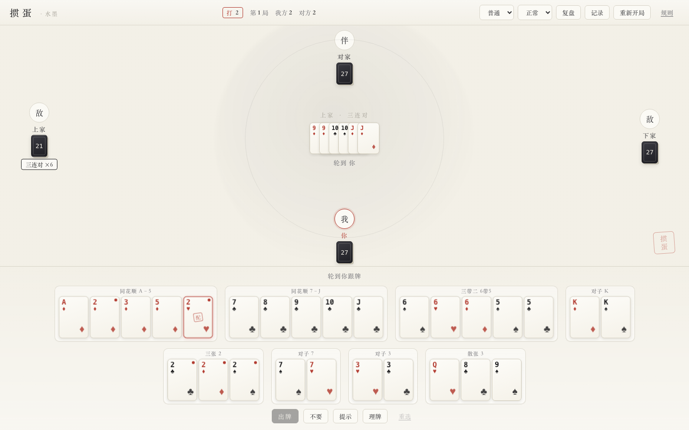
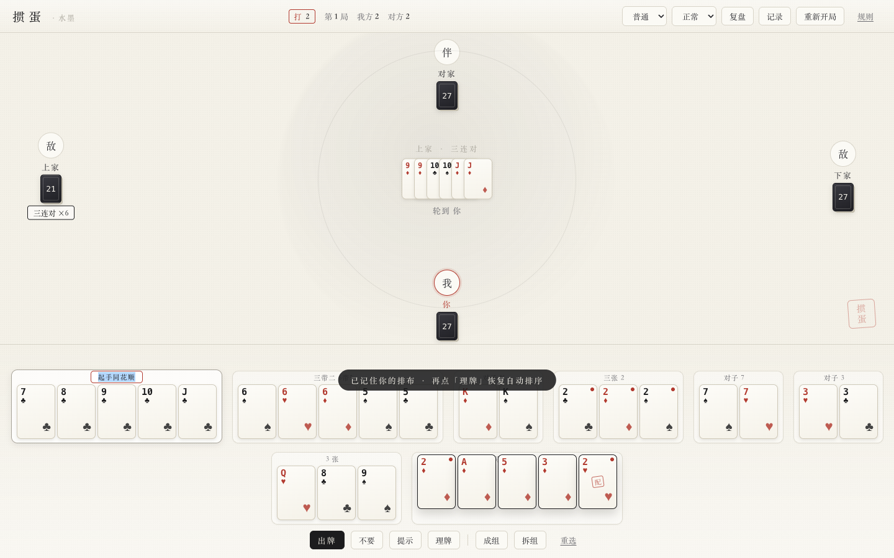
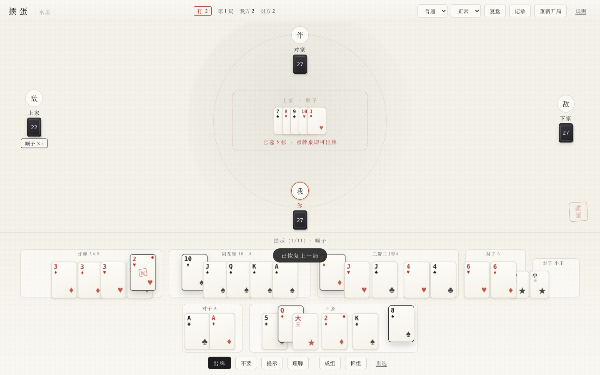
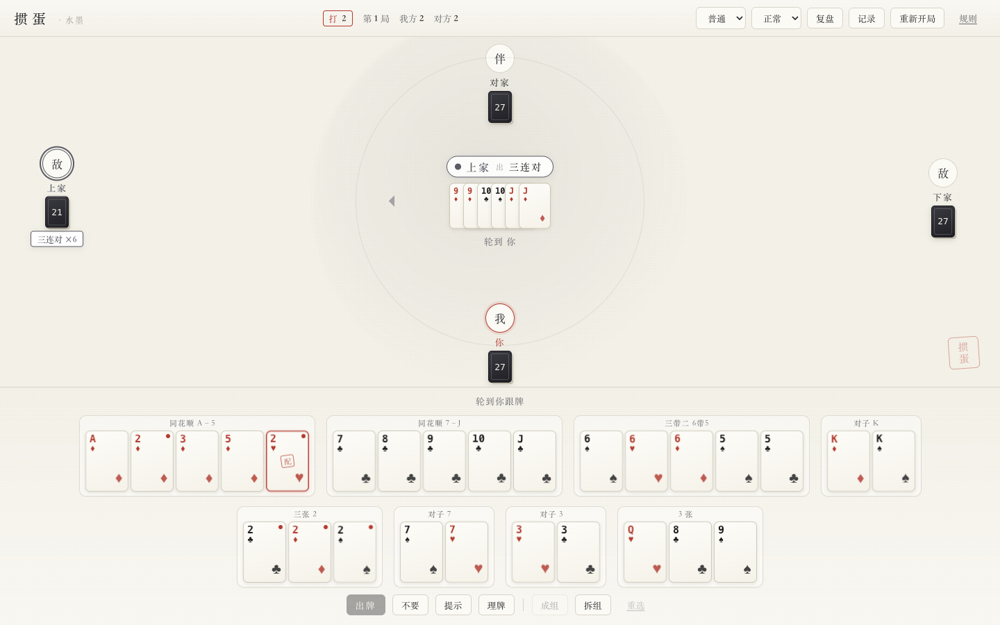
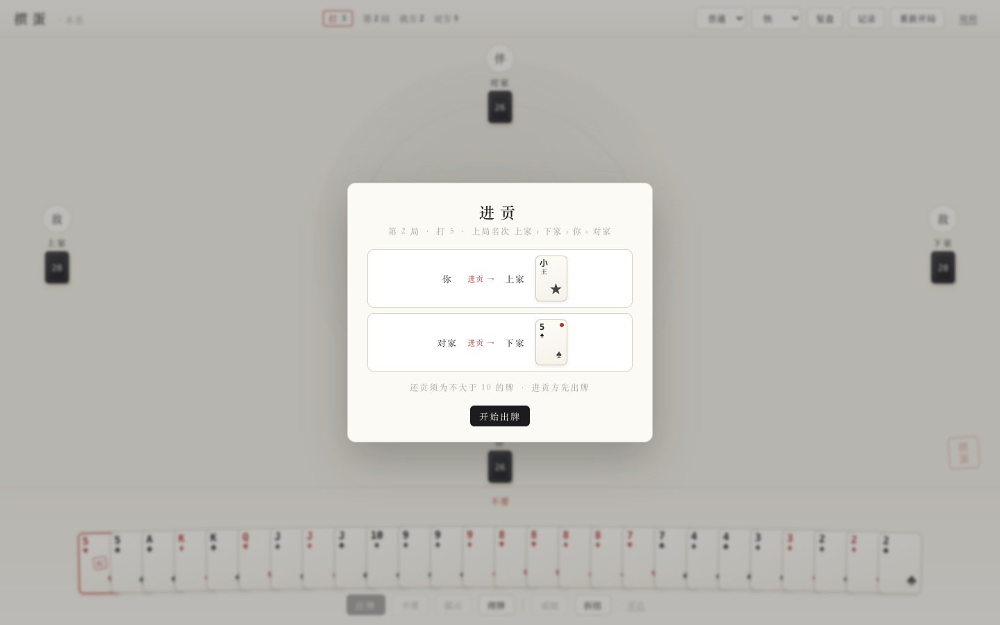
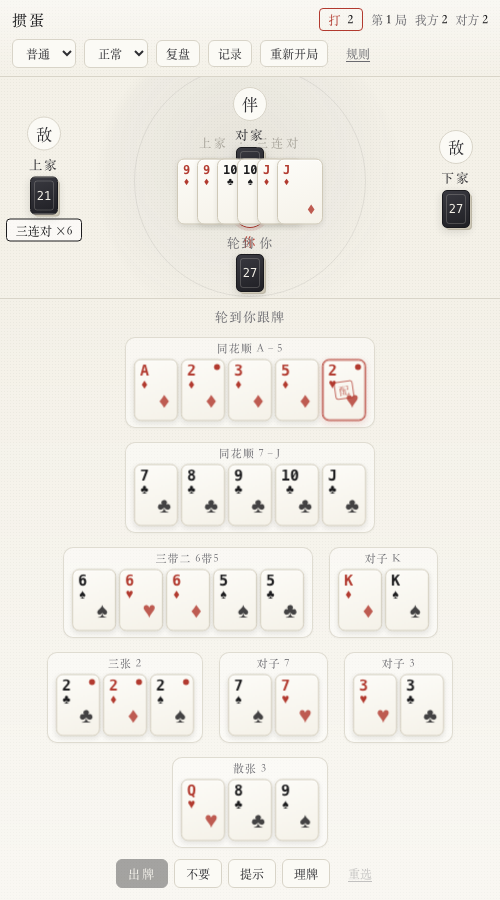

# 掼蛋 · 水墨（Guandan Ink）

> 江苏规则的单机掼蛋游戏 · 1 名真人 + 3 个 AI · 纯前端离线可玩 · 水墨极简视觉



<sub>自动按牌型拆分 + 手动成组（「起手同花顺」是我自己命名的一组）：</sub>

<sub>选好牌 → 点牌桌就能出，不用再去够按钮：</sub>

<sub>中央胶囊 + 箭头 + 座位描边，一眼看出这一手是谁出的：</sub>

<sub>每局开头的进贡面板：谁给谁进了什么牌，一目了然：</sub>

<sub>手机竖屏（分组自动换行）：</sub>

### ▶ 在线直接玩：<https://fawkes-s.github.io/guandan/>

手机浏览器打开后「添加到主屏幕」即可装成 App，装完**离线也能玩**。

  

---

## 特性

- **PWA**：可「添加到主屏幕」，装成独立 App，Service Worker 预缓存全部资源，**飞行模式也能玩**
- 完整江苏规则引擎（108 张 / 逢人配 / 接风 / 进贡还贡抗贡 / 过 A），所有分歧点可配置
- 三档 AI：手牌拆分估值 + 记牌推断 + 威胁反应（对手剩 1 张会拦截和接管）
- 手牌可**按牌型分组**并自由拖拽排布
- 牌谱 / 记牌 / 复盘、Web Audio 合成音效、水墨极简视觉

## 怎么带走 / 怎么分享给别人

一句话：**`npm run build:single` 产出的 `release/掼蛋.html` 就是整个游戏**，
122 KB 一个文件，双击就玩，不用装任何东西、不用联网。

```bash
npm run build:single   # 产出 release/掼蛋.html（+ 一个 zip，方便直接发人）
npm run share          # 起局域网服务器，终端打二维码，手机同 Wi-Fi 扫码就玩
npm run pack           # 上面两个都做，再打成 zip
```

| 场景 | 怎么做 |
|---|---|
| 换台电脑自己玩 | 拷 `release/掼蛋.html`，双击 |
| 发给朋友、对方想离线玩 | 发 `release/掼蛋单机版.zip`（38 KB） |
| 一屋子人各自用手机玩 | `npm run share`，扫码 |
| 发给很多人 / 装成手机 App | 推到 GitHub，自动发布到 Pages —— 见 [`docs/GITHUB.md`](docs/GITHUB.md) |
| 不想用 GitHub | `npm run build` 后把 `dist/` 拖到 [Netlify Drop](https://app.netlify.com/drop) |

- **放到 GitHub 上（推荐）**：保存 / 管理 / 自动测试 / 自动发布一条龙，
  最后拿到 `https://<用户名>.github.io/guandan/` 这样的网址，任何联网设备打开就能玩。
  分步操作见 **[`docs/GITHUB.md`](docs/GITHUB.md)**；仓库里已配好 Actions 工作流，本地仓库也已初始化并提交。
- 其他部署方式（Vercel / Cloudflare / Netlify）与"复制文件夹到别的电脑时哪些该带"：
  **[`docs/DEPLOY.md`](docs/DEPLOY.md)**

## 快速开始

```bash
cd guandan
npm install          # 若报 npm 缓存权限错误：npm install --cache ./.npm-cache
npm run dev          # 开发服务器，浏览器打开提示的地址
npm test             # 全部单元 / 集成 / UI 测试
npm run build        # 产出 dist/，纯静态，可直接离线打开
npm run bench        # AI 自对弈基准（各难度胜率与决策耗时）
npm run e2e          # 真实浏览器 E2E（拖拽排布 / 整组选中 / 提示出牌 / 快捷键）
npm run build:single # 单文件版：release/掼蛋.html，双击即玩
npm run share        # 局域网分享：终端出二维码，手机扫码玩
```

构建产物 `dist/` 是一个完整的 PWA：`manifest.webmanifest` + `sw.js`，用任意静态服务器
（`npm run preview`）打开即可安装。手机上「添加到主屏幕」后是全屏无地址栏的独立 App。

> `npm run e2e` 用 Playwright 驱动**系统已装的 Chrome**（`channel: 'chrome'`），
> 不需要再下载 300MB 的浏览器二进制。

常用深链：

| 链接 | 作用 |
|---|---|
| `http://127.0.0.1:5273/` | 正常对局 |
| `?spectate=1` | 观战模式（四家全 AI，自动连打） |
| `?seed=42` | 固定随机种子，复现同一副牌 |
| `?difficulty=hard` | 指定 AI 难度 |
| `?drawer=log` / `?drawer=count` | 启动即展开「牌谱 / 记牌」侧栏 |
| `?replay=1` | 启动后自动进入复盘 |
| `?sort=combo` | 启动即用「按牌型」理牌视图 |

---

## 操作说明

### 鼠标 / 触屏

| 操作 | 说明 |
|---|---|
| 点击手牌 | 选中 / 取消（选中的牌会抬起） |
| **按住拖动** | 划过的手牌连续选中 / 取消（框选） |
| **双击手牌** | 直接打出这一张 |
| 出牌 | 打出选中的牌；逢人配存在多种解释时弹出选择器 |
| 不要 | 过牌（首出时不可用） |
| 提示 | 循环给出所有能压过上家的出法，再按一次换下一种 |
| **理牌 / `S`** | 按大小 → 按花色 → 按张数 → **按牌型** 循环切换 |
| **拖动牌** | 把牌拖到任意位置重排，或拖进别的组 |
| **拖到「新建一组」** | 把这张牌单独分出来，自己起一组 |
| **点组标签** | 正好选中这一组 / 再点取消（一整手直接打出） |
| **拖组标签** | 整组移动到其他位置 |
| **成组 / `G`** | 把选中的几张牌按**自己的意思**组成一组 |
| **拆组 / `U`** | 选中整组后拆开，牌回到「未分组」 |
| **点 ✎ / 右键标签** | 给这一组起自己的名字 |
| 记录 | 打开侧栏：牌谱 / 记牌 / 操作说明 |
| 复盘 | 逐步回放本局，可自动播放 |
| 难度 / 速度 | 右上角选择 AI 水平与思考速度 |

### 手牌排布：自动分组 + **完全按自己的意思重排**

平铺 27 张牌看不清结构，所以「理牌」多了一档 **按牌型**：自动把手牌拆成互相独立的区块，
每块带标签（`顺子 3–7`、`三带二 6带5`、`同花顺 A–5`、`炸弹 K×4`、`逢人配`…）。

**但自动拆分只是起点，最终怎么分由你说了算：**

| 你想做的事 | 怎么做 |
|---|---|
| 我认定的这几张就是一组 | 选中它们 → **成组**（`G`） |
| 这个自动分组我不认同 | 点组标签选中 → **拆组**（`U`），牌回到「未分组」 |
| 这张牌我要单独放 | 拖到末尾的 **「拖到这里新建一组」** |
| 这组我想叫自己的名字 | 点标签上的 **✎** 或右键 → 输入名字 |
| 组的位置不对 | 直接拖组标签换位 |

几个关键设计：

- **标签永远跟着牌面走** —— 只要没起自定义名字，拖完之后标签会按当前内容重新推导，
  绝不会出现「写着顺子、里面却是别的牌」。起了名字就用你的名字（朱砂描边显示）。
- **打乱后不会被自动重排覆盖**：一旦你手工调整过，之后出牌/进贡导致牌变化时只做增删，
  不会推倒重来；再点一次「理牌」才恢复自动排序。
- **等别人出牌时也能理牌**，不用等到自己回合。

自动拆牌算法在 `src/core/split.ts`：只调用一次合法出牌枚举，再在候选表上做贪心集合覆盖
（炸弹整体保留、优先长牌型、少消耗逢人配），最后把余牌归成三张/对子/散张/逢人配。

### 键盘

| 按键 | 作用 |
|---|---|
| `空格` / `回车` | 出牌；没有选牌或压不过时直接过 |
| `H` | 提示（循环） |
| `L` | 开关侧栏 |
| `R` | 打开复盘 |
| `M` | 开关音效 |
| `Esc` | 清空选牌 / 关闭弹层 / 收起侧栏 |

---

## 音效与动效

**音效**全部由 Web Audio 实时合成，工程内**没有任何音频素材文件**：

| 事件 | 声音设计 |
|---|---|
| 发牌 | 六段带通噪声扫频，模拟纸牌摩擦 |
| 出牌 | 噪声「唰」+ 低频垫音 |
| 不要 | 双音下行正弦 |
| 炸弹 | 锯齿波 160→42Hz 下扫 + 方波 + 噪声爆裂 |
| 进贡 / 还贡 | 双音上行提示音 |
| 名次 | 铃音 |
| 胜 / 负 | 大调 / 小调琶音 |

音频上下文在**首次用户手势后**才创建，不会触发浏览器自动播放警告；`M` 键或侧栏复选框可随时开关。

**动效**：

- 发牌逐张错峰入场；出牌时牌从座位**飞向牌桌中央**落位
- 手牌用 **FLIP** 技术：出牌后剩余的牌平滑滑动补齐，而不是瞬间跳变
- 手牌按可用宽度自动收紧重叠量，并排成**扇形弧线**；窄屏自动换行成多行
- 过牌 / 进贡 / 接风在对应座位**浮出气泡**
- 炸弹：三重朱砂墨晕扩散 + 全屏轻微震动
- 逢人配轮到出牌时**脉冲高亮**；AI 思考时省略号跳动
- 结算弹层的名次逐行滑入
- 侧栏设置里可一键关闭全部动效（也会自动尊重系统的 `prefers-reduced-motion`）

---

## 牌谱 · 记牌 · 复盘

侧栏（`L` 或「记录」）三个页签：

- **牌谱**：按「手」分组列出四家每一轮出了什么牌（含牌面缩略图）或「不要」，最新的在最上面。
- **记牌**：大王 / 小王 / 级牌 / A~2 共 15 档，显示**除我手牌与已出牌之外还剩几张在外面**，出完的档位自动灰掉，级牌一档朱砂描边。
- **操作**：快捷键与规则速查。

**复盘**（`R` 或「复盘」）：从出牌阶段的手牌快照出发，逐步重建每一手之后的四家剩余张数与我当时的手牌，支持上一步 / 下一步 / 拖动进度条 / 自动播放（700ms 一步）。

---

## 规则实现范围

完整规则基线与出处见 [`docs/RULES.md`](docs/RULES.md)（依据联众掼蛋官方规则页）。

- 2 副牌 108 张，四人各 27 张，**对家为队友**，逆时针出牌
- **级牌**大于 A、小于小王；**红桃级牌 = 逢人配**，可替代除大小王外任意牌
- 10 种牌型全部实现：单张 / 对子 / 三同张 / 三带二 / 顺子(5 张) / 三连对(木板) / 钢板 / 炸弹(4~10 张) / 同花顺 / 四大天王
- 压制序：`四大天王 > 六张及以上炸弹 > 同花顺 > 五张及以下炸弹 > 普通牌型`
- 顺子 A 可作 1（A2345）与作 14（10JQKA），**不允许 JQKA2**
- **一手多解取最强**：逢人配参与的牌型有多种读法时，一律取最强的解释（牌是同样几张，强解释严格不劣于弱解释），所以「红桃7 8 (配) 10 J」会判定为**同花顺**而不是顺子
- **双下提前收局**：头游与二游同队时升级已成定局（+3），本局立即结束，不再空打三游/末游
- **接风**（对门借风）、**进贡 / 还贡 / 抗贡**（两张大王）完整实现
- 升级：头游+二游升 3 级 / +三游升 2 级 / +末游升 1 级，升级不跳过 A
- **过 A**：打 A 时须「一人头游、另一人非末游」才算取胜；三次不过 A 降回 2 重打

所有存在地区差异的规则点集中在 `src/core/rules.ts` 的 `RuleConfig`，可一处切换。

---

## 技术栈与工程结构

**Vite + TypeScript（strict）+ 原生 DOM/CSS + Vitest**，运行时零依赖。

```
guandan/
├─ docs/                  PLAN / RULES / PROGRESS / preview.png
├─ src/
│  ├─ core/               纯逻辑，零 DOM，100% 可单测
│  │  ├─ types.ts         牌 / 花色 / 牌型定义
│  │  ├─ cards.ts         牌堆、排序、比点、可复现随机数
│  │  ├─ combos.ts        牌型识别（含逢人配枚举）
│  │  ├─ compare.ts       压制判定
│  │  ├─ split.ts         按牌型拆分（理牌分组的算法）
│  │  ├─ candidates.ts    合法出牌枚举（AI 与「提示」共用）
│  │  ├─ handEval.ts      手牌估值（最少手数 / 控制力）
│  │  ├─ rules.ts         规则配置
│  │  ├─ tribute.ts       进贡 / 还贡 / 抗贡
│  │  ├─ scoring.ts       升级与过 A 结算（纯函数）
│  │  ├─ engine.ts        对局状态机
│  │  ├─ ai.ts            AI 决策（三档难度）
│  │  ├─ bench.ts         自对弈基准
│  │  └─ autoplay.ts      自动对局驱动
│  ├─ ui/                 渲染与交互
│  │  ├─ app.ts           控制器（可被 jsdom 测试驱动）
│  │  ├─ render.ts        视图渲染 + 手牌排版
│  │  ├─ anim.ts          FLIP / 飞牌 / 气泡 / 震屏特效
│  │  ├─ sound.ts         Web Audio 合成音效
│  │  ├─ handOrganizer.ts 手牌排布（排序 / 分组 / 拖拽后的自定义顺序）
│  │  ├─ panel.ts         牌谱 / 记牌 / 复盘面板
│  │  ├─ replay.ts        复盘重建模型
│  │  ├─ main.ts          启动入口（解析深链参数）
│  │  └─ style.css        水墨极简样式
│  └─ test/               单元 / 集成 / UI 测试
├─ e2e/                   真实浏览器 E2E（Playwright）
├─ scripts/               打包 / 局域网分享脚本
├─ .github/workflows/     推送到 GitHub 自动发布 Pages
├─ dist/                  可部署的静态站点（PWA）
└─ release/               单文件版（一个 html 就是整个游戏）
```

**架构原则**：`core` 是确定性的纯逻辑状态机（随机数可注入），`ui` 只做「渲染 state + 派发 action」。
因此 AI 自动对局、复盘重建、单元测试、jsdom 交互测试全部免费获得。

---

## AI 设计

| 难度 | 行为 |
|---|---|
| 轻松 | 从较优的几种出法里随机挑，偶尔无理由过牌 |
| 普通 | 手牌拆分估值 + 记牌 + **基础威胁反应**（对手剩 1 张会拦截、会从队友手里接管出牌权） |
| 困难 | 普通档 + 炸弹威胁精确判定 + 残局精确收束 |

关键启发式：

- 队友的牌原则上不压，除非对手快走完或自己能一把走完
- 跟对手时便宜的牌才顶（用级牌 / 王有牌力代价），炸弹有额外惩罚
- 对手只剩 ≤2 张时解除炸弹惩罚，全力拦截
- 队友只剩 1 张时，首出最小单张「喂牌」给队友走
- 记牌推断「这张牌是否已无人能压」，据此决定留牌还是抢出牌权

### 实测强度（`npm run bench`，固定种子）

| 对局组合 | 胜率 | 平均局数 |
|---|---|---|
| 困难 vs 轻松 | **100%**（36–0） | 5.8 |
| 普通 vs 轻松 | **100%**（36–0） | 6.4 |
| 困难 vs 普通 | **51.3%**（40–38） | 12.3 |

满手 27 张时单次决策平均 **约 2.1 ms**（p95 ≈ 1.7 ms，最坏 ≈ 48 ms），交互完全不卡。

> 诚实说明：困难与普通的差距只有约 1–5 个百分点 —— 两者共用同一套估值器与走法生成器，
> 差别只在炸弹威胁的精确判定；轻松档是刻意做弱的。也就是说「普通」已经是能打的对手，
> 「困难」的增益有限。要真正拉开档次，需要给困难档加多步搜索（见「后续可做」）。

---

## 已知限制

- 存档不保存随机数生成器状态，恢复后**后续的发牌顺序**会与不中断时不同（已进行的牌局状态完全一致）。
- 音效需要一次用户交互才会启用（浏览器策略），这是预期行为。
- 复盘展示「当时我的手牌」与各家剩余张数，不展示对手手牌（避免作弊）。
- 手牌的手工排布在当前局内有效，刷新页面后会回到自动排序（牌局本身仍可续上）。
- 提示功能给的是「从小到大的所有合法出法」，不是「推荐出法」；照着一直点会把牌拆散。
- 跟牌时若逢人配存在多种解释，引擎自动取「刚好压过」的那种，没有给玩家挑选的机会。

---

## 文档

- [`docs/PLAN.md`](docs/PLAN.md) — 完整开发计划、视觉方案、里程碑与验收标准
- [`docs/RULES.md`](docs/RULES.md) — 规则基线与可配置分歧点
- [`docs/GITHUB.md`](docs/GITHUB.md) — 放到 GitHub 上：保存 / 管理 / 测试 / 发布全流程
- [`docs/DEPLOY.md`](docs/DEPLOY.md) — 带走 / 分享 / 部署的完整方案
- [`docs/PROGRESS.md`](docs/PROGRESS.md) — 实时进度与变更日志
